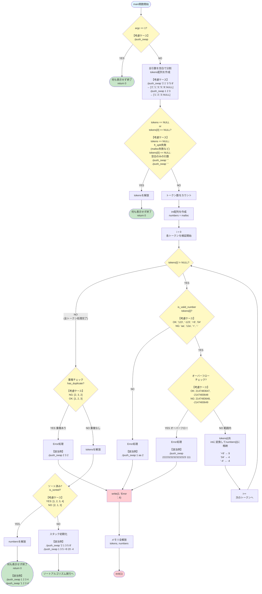

# push_swap
## 入力解析

```mermaid
flowchart TD
    Start(["main関数開始"]) --> CheckArgc{"argc == 1?<br/><br/>【考慮ケース】<br/>./push_swap"}
    
    CheckArgc -->|"YES"| End1(["何も表示せず終了<br/>return 0"])
    CheckArgc -->|"NO"| SplitArgs["全引数を空白で分割<br/>tokens配列を作成<br/><br/>【考慮ケース】<br/>./push_swap '2  1' 3 '5 8'<br/>→ ['2','1','3','5','8',NULL]<br/>./push_swap 1 2 3<br/>→ ['1','2','3',NULL]"]
    
    SplitArgs --> CheckTokens{"tokens == NULL<br/>or<br/>tokens[0] == NULL?<br/><br/>【考慮ケース】<br/>tokens == NULL:<br/>  ft_split失敗<br/>  (malloc失敗など)<br/>tokens[0] == NULL:<br/>  空白のみの引数<br/>  ./push_swap ' '<br/>  ./push_swap '  '"}
    
    CheckTokens -->|"YES"| FreeTokens1["tokensを解放"]
    FreeTokens1 --> End2(["何も表示せず終了<br/>return 0"])
    
    CheckTokens -->|"NO"| CountTokens["トークン数をカウント"]
    CountTokens --> CreateArray["int配列を作成<br/>numbers = malloc"]
    
    CreateArray --> LoopStart["i = 0<br/>各トークンを検証開始"]
    
    LoopStart --> LoopCheck{"tokens[i] != NULL?"}
    
    LoopCheck -->|"NO<br/>(全トークン処理完了)"| CheckDuplicate{"重複チェック<br/>has_duplicate?<br/><br/>【考慮ケース】<br/>NG: [2, 3, 2]<br/>OK: [1, 2, 3]"}
    
    LoopCheck -->|"YES"| ValidNumber{"is_valid_number<br/>tokens[i]?<br/><br/>【考慮ケース】<br/>OK: '123', '-123', '+9', '04'<br/>NG: 'aa', '12a', '+', '-'"}
    
    ValidNumber -->|"NO"| Error1["Error処理<br/><br/>【該当例】<br/>./push_swap 1 aa 2"]
    ValidNumber -->|"YES"| CheckOverflow{"オーバーフロー<br/>チェック?<br/><br/>【考慮ケース】<br/>OK: 2147483647, -2147483648<br/>NG: 2147483648, -2147483649"}
    
    CheckOverflow -->|"YES オーバーフロー"| Error2["Error処理<br/><br/>【該当例】<br/>./push_swap 22223232323232323 111"]
    CheckOverflow -->|"NO 範囲内"| ConvertInt["tokens[i]を<br/>intに変換してnumbers[i]に格納<br/><br/>'+9' → 9<br/>'04' → 4<br/>'-4' → -4"]
    
    ConvertInt --> Increment["i++<br/>次のトークンへ"]
    Increment --> LoopCheck
    
    CheckDuplicate -->|"YES 重複あり"| Error3["Error処理<br/><br/>【該当例】<br/>./push_swap 2 3 2"]
    CheckDuplicate -->|"NO 重複なし"| FreeTokens2["tokensを解放"]
    
    FreeTokens2 --> CheckSorted{"ソート済み?<br/>is_sorted?<br/><br/>【考慮ケース】<br/>YES: [1, 2, 3, 4]<br/>NO: [2, 1, 3]"}
    
    CheckSorted -->|"YES"| FreeNumbers["numbersを解放"]
    FreeNumbers --> End3(["何も表示せず終了<br/>return 0<br/><br/>【該当例】<br/>./push_swap 1 2 3 4<br/>./push_swap '1 2 3 4'"])
    
    CheckSorted -->|"NO"| InitStack["スタック初期化<br/><br/>【該当例】<br/>./push_swap '2  1 3 5 8'<br/>./push_swap 1 3 5 +9 20 -4"]
    InitStack --> Success(["ソートアルゴリズム実行へ"])
    
    Error1 --> ErrorOutput["write(2, 'Error\n', 6)"]
    Error2 --> ErrorOutput
    Error3 --> ErrorOutput
    
    ErrorOutput --> FreeAll["メモリ全解放<br/>tokens, numbers"]
    FreeAll --> Exit(["exit(1)"])
    
    style Start fill:#e1f5ff
    style End1 fill:#c8e6c9
    style End2 fill:#c8e6c9
    style End3 fill:#c8e6c9
    style Success fill:#c8e6c9
    style Exit fill:#ffcdd2
    style ErrorOutput fill:#ffcdd2
    style CheckArgc fill:#fff9c4
    style CheckTokens fill:#fff9c4
    style LoopCheck fill:#fff9c4
    style ValidNumber fill:#fff9c4
    style CheckOverflow fill:#fff9c4
    style CheckDuplicate fill:#fff9c4
    style CheckSorted fill:#fff9c4
```
